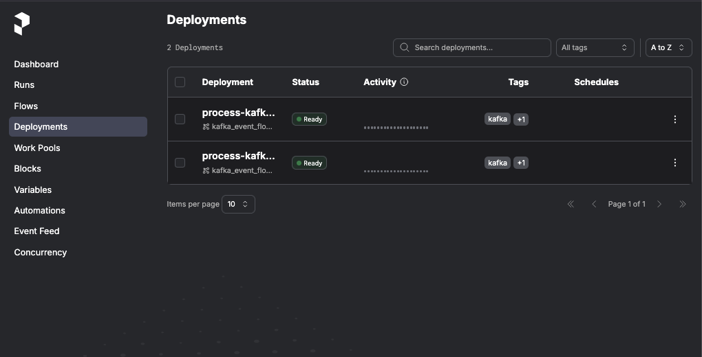
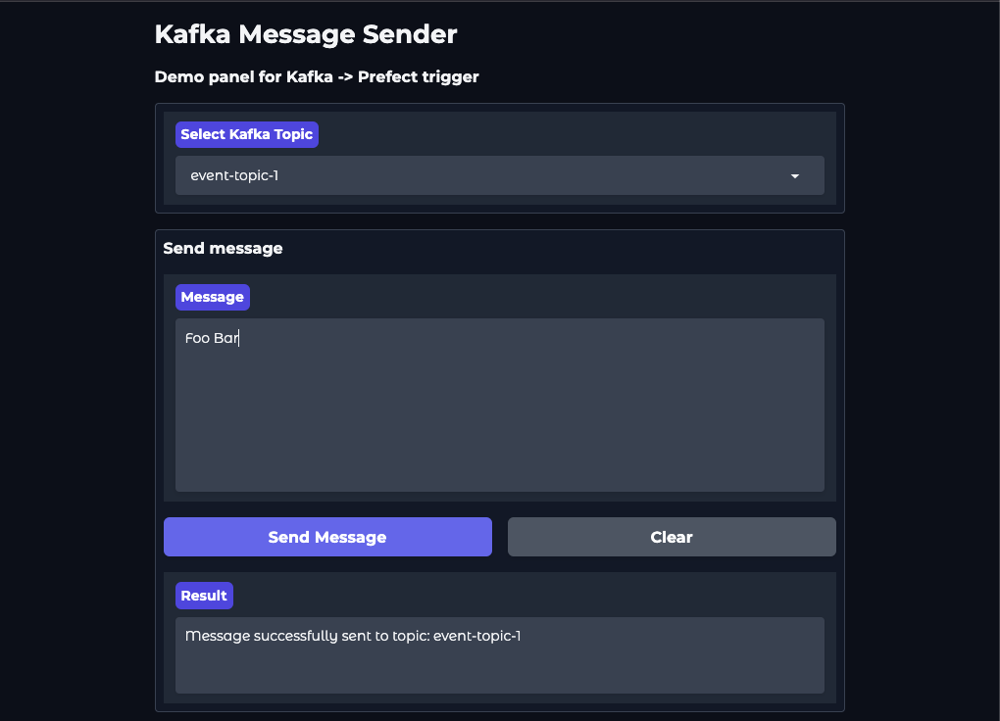
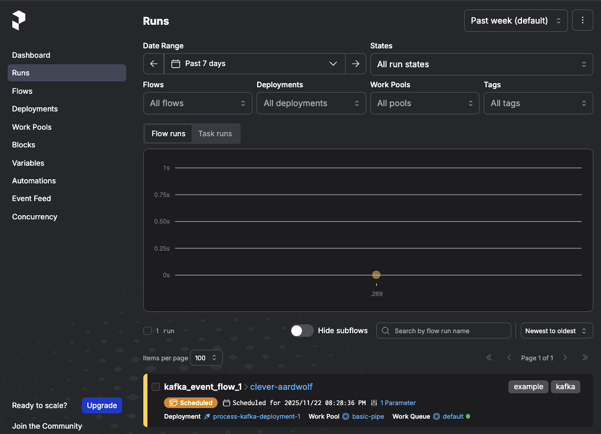
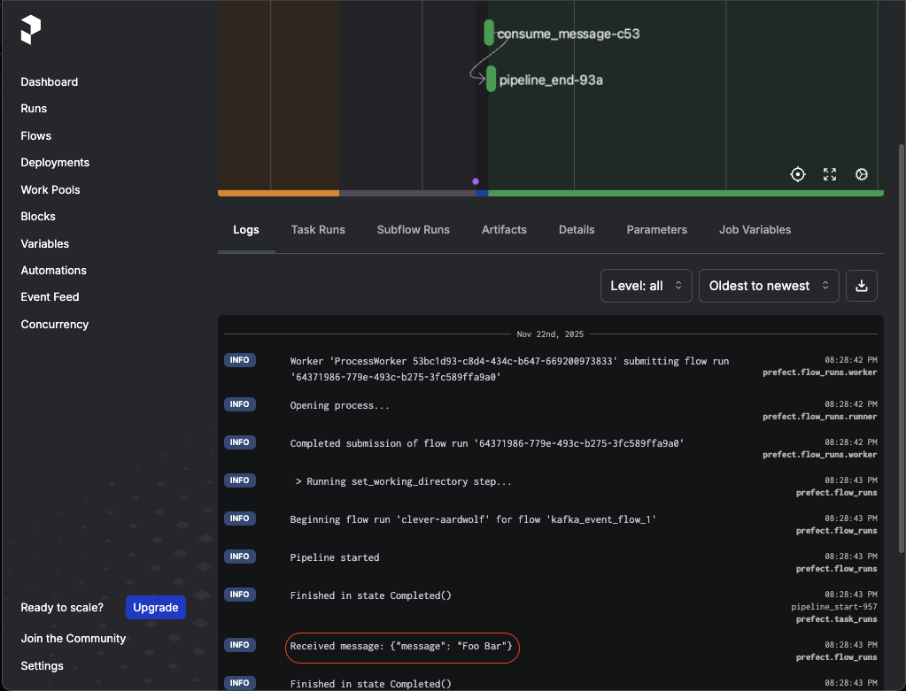

# Kafka-Prefect Connector

[](https://www.python.org/)
[](https://github.com/jerryjuiceme/kafka-prefect-connector/commits)


This project is a Python-based stateless application designed to act as an event trigger (similar to an Airflow Sensor) for Prefect workflows. It bridges the gap between Apache Kafka and Prefect by consuming messages from specific Kafka topics and triggering corresponding Prefect deployments via the Prefect API.

The application creates asynchronous Kafka consumers based on a provided configuration. It is built using **FastAPI** for lifecycle management and health checks, **Pydantic** for robust validation, **AIOKafka** for asynchronous message consumption, and **HTTPX** for non-blocking API requests to the Prefect Server.

## Tech Stack

- **Language:** Python 3.12+
- **Framework:** FastAPI (Lifecycle management, Healthcheck)
- **Validation:** Pydantic
- **Kafka Client:** AIOKafka
- **HTTP Client:** HTTPX
- **Package Manager:** uv

## Configuration

The core logic relies on a configuration file mapping Kafka topics to Prefect deployments. The application enforces a **1 Topic -> 1 Deployment** logic.

The file must be named `kafka-prefect-config.json` and placed either in the **parent directory** or in `./prefect_topics_config/kafka-prefect-config.json`.

### Configuration Structure

The configuration is an array of JSON objects. The application validates this file at startup; if validation fails, the service will not start.

**Example `kafka-prefect-config.json`:**

```json
[
  {
    "deploymentName": "process-kafka-deployment-1",
    "flowName": "kafka_event_flow_1",
    "deploymentId": "a274b5a3-4de7-4031-ad5c-d51620ac3013",
    "topic": "event-topic-1"
  },
  {
    "deploymentName": "process-kafka-deployment-2",
    "flowName": "kafka_event_flow_2",
    "topic": "event-topic-2"
  }
]
```

**Fields:**

- `topic`: (Required) The Kafka topic to listen to.
- `flowName`: (Required) The name of the Prefect flow.
- `deploymentName`: (Required) The name of the Prefect deployment.
- `deploymentId`: (Optional) The UUID of the deployment. If provided and enabled via environment variables, the app uses this ID for API calls directly. If omitted, the app resolves the deployment by flow and deployment names.

### Environment Variables

The application behavior can be tuned via `.env` file variables:

- `APP_CONFIG__PREFECT__USE_DEPLOYMENT_ID`: (Default: `False`)
  - If `False`: The application triggers runs using `flowName` and `deploymentName`.
  - If `True`: The application attempts to use `deploymentId` first (if available in the config). This is useful if you know the IDs statically. Defaults to False to support dynamic environments like the demo infrastructure where IDs are generated at runtime.
- `APP_CONFIG__RUN_RETRY_LIMIT`: (Default: `5`)
  - Defines the number of attempts to connect to the Kafka broker upon startup. If the connection fails, the app waits (increasing interval by 3 seconds per attempt) and retries. If the limit is reached, the application exits.

## Demo Infrastructure

To demonstrate the full capabilities of this project, a complete infrastructure stack is provided. This allows you to simulate a production-like environment locally.

The demo infrastructure includes:

- **Prefect Server:** The orchestration backend.
- **Prefect Worker:** A pre-configured worker that automatically creates example Flows and Deployments (matching the example config) upon startup.
- **Kafka & Zookeeper:** The message broker system.
- **Kafka UI:** A web interface to view topics and messages.
- **Gradio Panel:** A custom admin panel to easily send test messages to Kafka topics.

## Getting Started

### Prerequisites

- Docker and Docker Compose
- Git
- uv (for local Python development)

### Installation

Clone the repository:

```bash
git clone https://github.com/jerryjuiceme/kafka-prefect-connector.git
cd kafka-prefect-connector
```

### Running with Docker

You can run the application in two modes using the provided Makefile.

**1\. Run Full Demo Infrastructure**

This command starts the Kafka-Prefect Connector along with Prefect, Kafka, Zookeeper, and the simulation tools.

```bash
make up-demo
```

_Equivalent to: `docker-compose -f docker-compose.yaml -f docker-compose-demo-infrastructure.yaml up -d`_

**2\. Run Only Kafka-Listener**

If you already have your infrastructure running externally, use this command to start only the connector service.

```bash
make up
```

### Running Locally

To run the `kafka-listener` service directly on your machine (outside of Docker), follow these steps:

1.  Navigate to the listener directory and install dependencies:

    ```bash
    make install-local
    ```

2.  Run the application:

    ```bash
    make run-local
    ```

    _Command runs: `uv run uvicorn src.main:app --host 0.0.0.0 --port 8000 --workers 1`_

## Usage Workflow (Demo)

Once the full infrastructure is running via `make up-demo`, follow this workflow to test the integration:

**1\. Verify Deployments**  
The Prefect Worker automatically creates deployments matching the example config.  
_URL:_ http://localhost:4200/deployments



**2\. Send a Kafka Message**  
Use the Gradio Admin Panel to simulate an event. Select a topic (e.g., `event-topic-1`) and send a JSON payload.

> _Note: In our demo, we're using string as a payload. In a real-world scenario, you would likely use a more complex data structure._

_URL:_ http://127.0.0.1:7860/



**3\. Connector Processing**  
The `kafka-listener` service consumes the message, validates the config mapping, and calls the Prefect API to trigger the specific deployment associated with that topic.

**4\. View Runs**  
Check the Prefect dashboard to see the triggered Flow Run.  
_URL:_ http://localhost:4200/runs



**5\. Check Logs**  
Open the specific run logs. The demo flow prints the content of the Kafka message, verifying the data pipeline was triggered successfully with the correct context.



## Make Commands Reference

| Command              | Description                             |
| :------------------- | :-------------------------------------- |
| `make up-demo`       | Starts the full stack (App + Infra)     |
| `make up`            | Starts only the Kafka-Listener service  |
| `make down`          | Stops and removes all containers        |
| `make install-local` | Installs Python dependencies using `uv` |
| `make run-local`     | Runs the app locally on port 8000       |

## Service URLs

- **Prefect UI:** http://localhost:4200
- **Gradio Message Sender:** http://127.0.0.1:7860/
- **Kafka UI:** http://localhost:8081
- **Kafka-Listener Health:** http://localhost:8000/health
